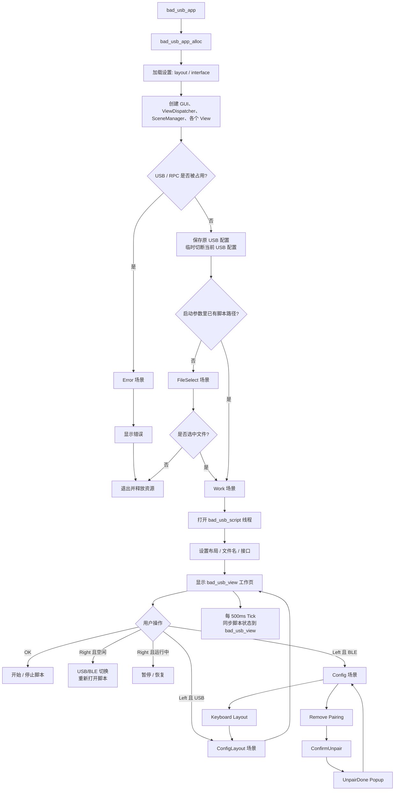

---
tags:
  - flipperzero
  - BadUSB
  - 脚本
  - 编程语言
---
# BadUSB

## Ducky Script

https://web.archive.org/web/20220816200129/http://github.com/hak5darren/USB-Rubber-Ducky/wiki/Duckyscript

Ducky Script（常称**DuckyScript**）是 Hak5 为**USB Rubber Ducky**设计的**专用 HID 键盘注入脚本语言**，让任何人都能快速编写自动化按键注入程序，实现系统控制、安全测试或批量操作

+   **本质**：一种**极简宏脚本语言**，将人类可读的指令转换为 USB 键盘设备可执行的按键序列，实现**毫秒级高速注入**。
+   **起源**：2010 年由 Hak5 开发，最初仅 3 个指令，现已迭代至**3.0 版本**，成为结构化编程语言。
+   **生态**：广泛应用于 USB Rubber Ducky、Flipper Zero、Key Croc 等设备，支持 Windows/macOS/Linux 多平台。

flipperzero的语法与经典的 USB Rubber Ducky 1.0 脚本兼容, 但提供了一些额外的命令和功能，例如自定义 USB ID、ALT+数字键盘输入方法、SYSRQ 命令以及更多功能键

### 基础命令

| 指令           | 功能             | 示例                                            |
| -------------- | ---------------- | ----------------------------------------------- |
| `REM`          | 注释             | `REM 这是一个示例脚本`                          |
| `DELAY`        | 单次延时（毫秒） | `DELAY 500`（等待 0.5 秒）                      |
| `DEFAULTDELAY` | 全局默认延时     | `DEFAULTDELAY 100`（每条指令前默认等待 0.1 秒） |
| `STRING`       | 输入文本         | `STRING Hello World!`                           |

### 特殊按键

| Command            | Notes            |
| ------------------ | ---------------- |
| DOWNARROW / DOWN   |                  |
| LEFTARROW / LEFT   |                  |
| RIGHTARROW / RIGHT |                  |
| UPARROW / UP       |                  |
| ENTER              |                  |
| DELETE             |                  |
| BACKSPACE          |                  |
| END                |                  |
| HOME               |                  |
| ESCAPE / ESC       |                  |
| INSERT             |                  |
| PAGEUP             |                  |
| PAGEDOWN           |                  |
| CAPSLOCK           |                  |
| NUMLOCK            |                  |
| SCROLLLOCK         |                  |
| PRINTSCREEN        |                  |
| BREAK              | Pause/Break key  |
| PAUSE              | Pause/Break key  |
| SPACE              |                  |
| TAB                |                  |
| MENU               | Context menu key |
| APP                | Same as MENU     |
| Fx                 | F1-F12 keys      |

### 修饰键

| Command | Notes        |
| ------- | ------------ |
| CTRL    |              |
| CONTROL | Same as CTRL |
| SHIFT   |              |
| ALT     |              |
| GUI     |              |
| WINDOWS | Same as GUI  |

### 按键长按

最多可以长按5个按键

| Command | Parameters                      | Notes                                    |
| ------- | ------------------------------- | ---------------------------------------- |
| HOLD    | Special key or single character | Press and hold key until RELEASE command |
| RELEASE | Special key or single character | Release key                              |

### 字符串

| Command  | Parameters  | Notes                                      |
| -------- | ----------- | ------------------------------------------ |
| STRING   | Text string | Print text string                          |
| STRINGLN | Text string | Print text string and press enter after it |

+   不同的string之间可以有延时

| Command              | Parameters        | Notes                                         |
| -------------------- | ----------------- | --------------------------------------------- |
| STRING_DELAY         | Delay value in ms | Applied once to next appearing STRING command |
| STRINGDELAY          | Delay value in ms | Same as STRING_DELAY                          |
| DEFAULT_STRING_DELAY | Delay value in ms | Apply to every appearing STRING command       |
| DEFAULTSTRINGDELAY   | Delay value in ms | Same as DEFAULT_STRING_DELAY                  |

### 重复

| Command | Parameters                   | Notes          |
| ------- | ---------------------------- | -------------- |
| REPEAT  | Number of additional repeats | 重复上一条命令 |

### ALT+字符

| Command   | Parameters     | Notes                                                        |
| --------- | -------------- | ------------------------------------------------------------ |
| ALTCHAR   | Character code | Print single character                                       |
| ALTSTRING | Text string    | Print text string using ALT+Numpad method                    |
| ALTCODE   | Text string    | Same as ALTSTRING, presents in some Duckyscript implementations |

### 媒体/消费控制

有一些媒体控制的按键

| Command | Parameters                | Notes |
| ------- | ------------------------- | ----- |
| MEDIA   | Media key, see list below |       |

实际可以使用的按键如下

| Key name    | Notes                        |
| ----------- | ---------------------------- |
| POWER       |                              |
| REBOOT      |                              |
| SLEEP       |                              |
| LOGOFF      |                              |
| EXIT        |                              |
| HOME        |                              |
| BACK        |                              |
| FORWARD     |                              |
| REFRESH     |                              |
| SNAPSHOT    | Take photo in a camera app   |
| PLAY        |                              |
| PAUSE       |                              |
| PLAY_PAUSE  |                              |
| NEXT_TRACK  |                              |
| PREV_TRACK  |                              |
| STOP        |                              |
| EJECT       |                              |
| MUTE        |                              |
| VOLUME_UP   |                              |
| VOLUME_DOWN |                              |
| FN          | Fn/Globe key on Mac keyboard |
| BRIGHT_UP   | Increase display brightness  |
| BRIGHT_DOWN | Decrease display brightness  |

### Fn按键(Global键)

| Command | Parameters                      | Notes |
| ------- | ------------------------------- | ----- |
| GLOBE   | Special key or single character |       |

### 等待按键按下

| Command               | Parameters | Notes                                                        |
| --------------------- | ---------- | ------------------------------------------------------------ |
| WAIT_FOR_BUTTON_PRESS | None       | Will wait for the user to press a button to continue script execution |

### USB设备ID

这个需要是在脚本的第一行

| Command | Parameters                   | Notes |
| ------- | ---------------------------- | ----- |
| ID      | VID:PID Manufacturer:Product |       |

```bash
ID 1234:abcd Flipper Devices:Flipper Zero
```

### 鼠标按键

| Command      | Parameters                    | Notes                            |
| ------------ | ----------------------------- | -------------------------------- |
| LEFTCLICK    | None                          |                                  |
| LEFT_CLICK   | None                          | functionally same as LEFTCLICK   |
| RIGHTCLICK   | None                          |                                  |
| RIGHT_CLICK  | None                          | functionally same as RIGHTCLICK  |
| MOUSEMOVE    | x y: int move mount/direction |                                  |
| MOUSE_MOVE   | x y: int move mount/direction | functionally same as MOUSEMOVE   |
| MOUSESCROLL  | delta: int scroll distance    |                                  |
| MOUSE_SCROLL | delta: int scroll distance    | functionally same as MOUSESCROLL |

## 代码实现

这部分的代码实现是在 `applications/main/bad_usb` 文件夹下面, 作为一个独立的应用进行实现

- 应用生命周期和界面调度在 bad_usb_app.c
- DuckyScript 解析、命令执行、按键映射在 ducky_script.c 和 ducky_script_commands.c
- 真正把按键/鼠标动作发到 USB 或 BLE HID 的封装在 bad_usb_hid.c
- UI 页面逻辑在 scenes 和 views 文件夹

基础的信息使用[[2026-07-19-20-format文件]] 进行管理,  在开启的时候从 `/ext/badusb/.badusb.settings`文件里面进行读取键盘布局和接口类型, 不存在的时候设置为默认值




### 界面

所有的界面实现的代码在文件`applications/main/bad_usb/scenes`里面

#### 声明

```c
#define ADD_SCENE(prefix, name, id) BadUsbScene##id,
typedef enum {
#include "bad_usb_scene_config.h"
BadUsbSceneNum,
} BadUsbScene;
#undef ADD_SCENE

extern const SceneManagerHandlers bad_usb_scene_handlers;

  
// Generate scene on_enter handlers declaration
#define ADD_SCENE(prefix, name, id) void prefix##_scene_##name##_on_enter(void*);
#include "bad_usb_scene_config.h"
#undef ADD_SCENE
  
// Generate scene on_event handlers declaration
#define ADD_SCENE(prefix, name, id) \
bool prefix##_scene_##name##_on_event(void* context, SceneManagerEvent event);
#include "bad_usb_scene_config.h"
#undef ADD_SCENE
  
// Generate scene on_exit handlers declaration
#define ADD_SCENE(prefix, name, id) void prefix##_scene_##name##_on_exit(void* context);
#include "bad_usb_scene_config.h"
#undef ADD_SCENE
```
对应的头文件是
```c
ADD_SCENE(bad_usb, file_select, FileSelect)
ADD_SCENE(bad_usb, work, Work)
ADD_SCENE(bad_usb, error, Error)
ADD_SCENE(bad_usb, config, Config)
ADD_SCENE(bad_usb, config_layout, ConfigLayout)
ADD_SCENE(bad_usb, confirm_unpair, ConfirmUnpair)
ADD_SCENE(bad_usb, unpair_done, UnpairDone)
```

这里把这几个界面展开为一系列的函数声明和enum

### 键盘布局

使用.kl文件描述不同键盘的布局映射表, 在实际发送的时候会使用ASCII码表和实际的键盘的键位表进行对照

```c
#define BADUSB_ASCII_TO_KEY(script, x) \
(((uint8_t)x < 128) ? (script->layout[(uint8_t)x]) : HID_KEYBOARD_NONE)
```

在加载配置的时候加载的文件路径, 最后会被记录在`BadUsbScript->layout`数组里

### 脚本执行

```c
struct BadUsbScript {
FuriHalUsbHidConfig hid_cfg;
const BadUsbHidApi* hid;
void* hid_inst;
FuriThread* thread;
BadUsbState st;
  
FuriString* file_path;
uint8_t file_buf[FILE_BUFFER_LEN + 1];
uint8_t buf_start;
uint8_t buf_len;
bool file_end;
  
uint32_t defdelay;
uint32_t stringdelay;
uint32_t defstringdelay;
uint16_t layout[128];
  
FuriString* line;
FuriString* line_prev;
uint32_t repeat_cnt;
uint8_t key_hold_nb;
  
FuriString* string_print;
size_t string_print_pos;
};
```

- `hid_cfg`, `hid`, `hid_inst`  
    这一组负责“怎么把 Flipper 伪装成 HID 设备”。`hid_cfg` 存 VID/PID、厂商名、产品名这类配置；`hid` 是一套 HID 操作接口表；`hid_inst` 是这套接口初始化后的具体实例。后面发按键、发鼠标、释放按键，都是通过 `bad_usb->hid->...` 调的。
- `thread`, `st`  
    这一组负责“脚本运行控制”。`thread` 是 BadUSB 的 worker 线程；`st` 是对外显示和内部状态机都要用的运行状态，比如 `Idle`、`Running`、`Paused`、`Done`、`ScriptError`。
- `file_path`, `file_buf`, `buf_start`, `buf_len`, `file_end`  
    这一组负责“脚本文件读取”。`file_path` 是脚本路径；`file_buf` 是一小块读文件缓冲区；`buf_start` 和 `buf_len` 表示当前缓冲区里还有多少没消费的数据；`file_end` 表示是否读到文件尾。这样它不是一次把整个脚本读进内存，而是边读边解析。
- `defdelay`, `stringdelay`, `defstringdelay`  
    这一组负责 Ducky Script 里的各种延时语义。比如 `DEFAULT_DELAY` 会写进 `defdelay`，`STRING_DELAY` / `DEFAULT_STRING_DELAY` 会写进后两个变量，执行时状态机会按这些值暂停。
- `layout[128]`  
    这是键盘布局映射表，用来做 `ASCII -> HID 键码` 转换。`.kl` 文件读进来的就是它，所以同一个 `STRING abc`，在不同键盘布局下能发出正确按键。
- `line`, `line_prev`, `repeat_cnt`, `key_hold_nb`  
    这一组负责“脚本语句级别的执行状态”。`line` 是当前正在解析的行，`line_prev` 是上一行，给 `REPEAT` 命令用；`repeat_cnt` 记录还要重复多少次；`key_hold_nb` 记录当前有多少键处于 `HOLD` 状态，避免超出 HID 同时按键上限。
- `string_print`, `string_print_pos`  
    这一组负责“带延迟的字符串输出”。当脚本执行 `STRING`，而且设置了字符间延时，就不会一次性打完整串，而是把待输出内容放到 `string_print`，再用 `string_print_pos` 记录当前打到第几个字符。

一个脚本的处理从这里开始

```c
BadUsbScript* bad_usb_script_open(FuriString* file_path, BadUsbHidInterface interface) {
	furi_assert(file_path);
	  
	BadUsbScript* bad_usb = malloc(sizeof(BadUsbScript));
	bad_usb->file_path = furi_string_alloc();
	furi_string_set(bad_usb->file_path, file_path);
	bad_usb_script_set_default_keyboard_layout(bad_usb);
	  
	bad_usb->st.state = BadUsbStateInit;
	bad_usb->st.error[0] = '\0';
	bad_usb->hid = bad_usb_hid_get_interface(interface);
	// 创建一个线程处理
	bad_usb->thread = furi_thread_alloc_ex("BadUsbWorker", 2048, bad_usb_worker, bad_usb);
	furi_thread_start(bad_usb->thread);
	return bad_usb;
} //-V773
```
